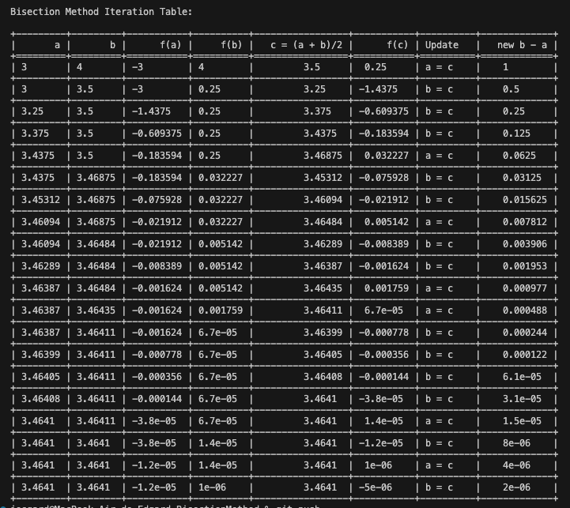

# 📊 Numerical Methods in Python

 A growing collection of classic **numerical algorithms** implemented in Python, focused on clarity, modularity, and educational value. Each method is organized independently to serve as a reference, learning tool, or base for academic or applied projects.

> 📘 Root finding, interpolation, integration, linear systems, and more — implemented one method at a time.

---

## 🚀 What’s Inside
This repository aims to include well-documented, clean implementations of key numerical methods, such as:

- ✅ Root-finding algorithms
- ✅ Interpolation techniques
- ✅ Numerical integration rules
- ✅ Solvers for systems of linear equations
- ✅ Numerical differentiation

Each algorithm will be organized in its own module and accompanied by:

- Step-by-step iteration output (tabulated)
- Optional visualizations (`matplotlib`)
- Practical usage examples
---

## ✅ Completed Methods

| Method Category   | Implemented          | Status   |
|-------------------|----------------------|----------|
| Root Finding      | Bisection Method     | ✅ Ready |
| Root Finding      | Newton-Raphson       | ✅ Ready |
| Root Finding      | Secant-Method        | ✅ Ready |
| Interpolation     | Coming Soon          | 🕐       |
| Integration       | Simpson 1/3 Method   | ✅ Ready |
| Integration       | Coming Soon          | 🕐       |
| Linear Systems    | Coming Soon          | 🕐       |
| Differentiation   | Coming Soon          | 🕐       |

---
## 📂 Project Structure
```
numerical-methods-python/
| 
├── README.md
├── RootApproximation/
├── ├── BisectionMethod
│       ├── bisecction_class.py
│       ├── main.py
│       ├── requirements.txt
├── ├── NewtonRapson
│       ├── newtonraphson_class.py
│       ├── derivation_class.py
│       ├── main.py
│       ├── requirements.txt
├── ├── SecantMethod
│       ├── plotter.py
│       ├── secant_class.py
|       ├── function_class.py
│       ├── main.py
│       ├── requirements.txt
│   ├── .gitignore
├── NumericalIntegration/
├── ├── SimpsonMethod
│       ├── simpson_class.py
│       ├── plot_class.py
│       ├── utils.py
│       ├── main.py
│       ├── requirements.txt
│   ├── .gitignore
└── LICENSE
```

## 🛠️ Installation

Make sure you have Python 3.7+ installed. Then install the required packages (for each method inside its respective folder):

```bash
pip install -r requirements.txt
```
And execute using:

```bash
python3 main.py
```

## 📊 Iteration Table (Tabulated Output)
This project includes built-in support for printing a tabulated summary of each iteration performed during the execution of the Bisection Method.

The table includes values such as:

Interval endpoints a and b

Function evaluations f(a), f(b)

Midpoint c = (a + b)/2

Function value at the midpoint f(c)

Which endpoint was updated

The size of the interval after each iteration

This makes it easy to follow the step-by-step convergence of the method.

## 🖥️ Tabulated Output Example
<p align="center">
  
</p>

## 🎓 Ideal For
- University-level numerical analysis courses

- Self-learners exploring applied math

- Developers needing reference implementations

- Interactive teaching and visual explanation


## 🤝 Contributing
This repository is evolving one method at a time. Feel free to open issues or pull requests to propose new features, improvements, or additional numerical methods.

## ⭐ Like this project?
Star it if you found it useful ⭐ and feel free to contribute!